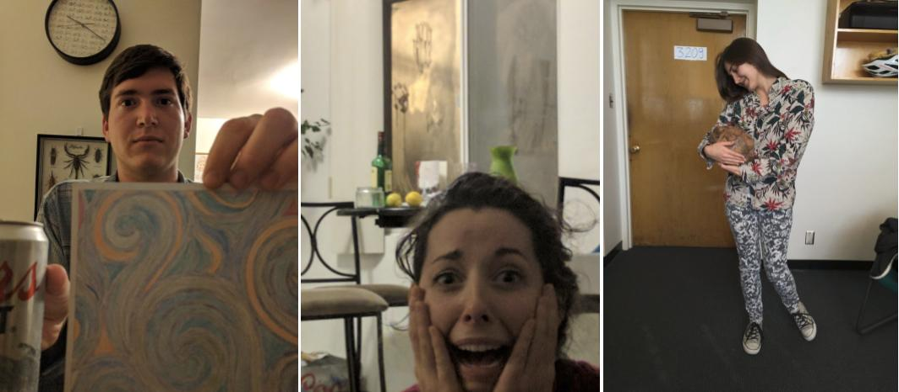

```{r setup, include=FALSE}
# code from
# http://www.statisticstoproveanything.com/2013/09/using-custom-images-as-pch-values-in-r.html

image_points = function(image, x, y, cex = 1, pos = NULL) {
  if (length(x) != length(y)) {
    stop("length(x)!=length(y): check your data")
  }
  dim.x = dim(image)[2]  #image width
  dim.y = dim(image)[1]  #image height
  if (dim.x == dim.y) {
    # obtian the ratio of width to height or height to width
    ratio.x = ratio.y = 1
  } else if (dim.x < dim.y) {
    ratio.x = dim.x/dim.y
    ratio.y = 1
  } else {
    ratio.x = 1
    ratio.y = dim.y/dim.x
  }
  cex = cex/10  #how large the image should be, divided by 10 so that it matches more closely to plotting points
  pin = par()$pin  #pin provides the width and height of the _active graphic device_
  pin.ratio = pin/max(pin)  #take the ratio
  usr = par()$usr  #usr provides the lower.x, lower.y, upper.x, upper.y values of the plotable region
  
  # combine the active device dimensions, the image dimensions, and the
  # desired output size
  image.size.y = (usr[4] - usr[3]) * pin.ratio[1] * cex
  image.size.x = (usr[2] - usr[1]) * pin.ratio[2] * cex
  for (i in 1:length(x)) {
    # plot each point pos can be NULL (default) or 1, 2, 3, or 4, corresponding
    # to centered (defualt), bottom, left, top, right, respectively.
    if (is.null(pos)) {
      # centered at (x,y), define the bottom/top and left/right boundaries of the
      # image
      x.pos = c(x[i] - (image.size.x * ratio.x)/2, x[i] + (image.size.x * 
                                                             ratio.x)/2)
      y.pos = c(y[i] - (image.size.y * ratio.y)/2, y[i] + (image.size.y * 
                                                             ratio.y)/2)
      
      rasterImage(image, x.pos[1], y.pos[1], x.pos[2], y.pos[2])
    } else if (pos == 1) {
      x.pos = c(x[i] - (image.size.x * ratio.x)/2, x[i] + (image.size.x * 
                                                             ratio.x)/2)
      y.pos = c(y[i] - (image.size.y * ratio.y), y[i])
    } else if (pos == 2) {
      x.pos = c(x[i] - (image.size.x * ratio.x), x[i])
      y.pos = c(y[i] - (image.size.y * ratio.y)/2, y[i] + (image.size.y * 
                                                             ratio.y)/2)
    } else if (pos == 3) {
      x.pos = c(x[i] - (image.size.x * ratio.x)/2, x[i] + (image.size.x * 
                                                             ratio.x)/2)
      y.pos = c(y[i], y[i] + (image.size.y * ratio.y))
    } else if (pos == 4) {
      x.pos = c(x[i], x[i] + (image.size.x * ratio.x))
      y.pos = c(y[i] - (image.size.y * ratio.y)/2, y[i] + (image.size.y * 
                                                             ratio.y)/2)
    }
    
    rasterImage(image, x.pos[1], y.pos[1], x.pos[2], y.pos[2])  #plot image
  }
}
```


```{r}
library(wesanderson); library(RCurl); library(jpeg)

URL = ("http://rushmore.shootangle.com/academy/images/quotepicz.jpg")
image = readJPEG(getURLContent(URL, useragent="curl/7.39.0 Rcurl/1.95.4.5"))  #gets the content of the URL

h <- data.frame(v = c(1:10, rep(5, 5), 1:10), h = c(rep(1, 10), 1:5, rep(5,10)))
b <- data.frame(v = c(1:10, 1:10), h = c(c(1,2.5,3.5,2.5,1,1,2.5,3.5,2,1)+10.5, rep(10.5,10)))
d <- data.frame(v = c(1:10, 1:10), h = c(c(1.05, 2, 3, 4, 5, 5, 4, 3, 2, 1.05)+20, rep(20,10)))

plot(1, type = "n", xlim = c(0, 27), ylim = c(0, 11), xlab = "", ylab = "", axes = F)
rect(par("usr")[1],par("usr")[3],par("usr")[2],par("usr")[4],col = wes_palette("Zissou"))
  
image_points(image, h$h, h$v, cex = 0.9)
image_points(image, b$h, b$v, cex = 0.9)
image_points(image, d$h, d$v, cex = 0.9)
```

### 

