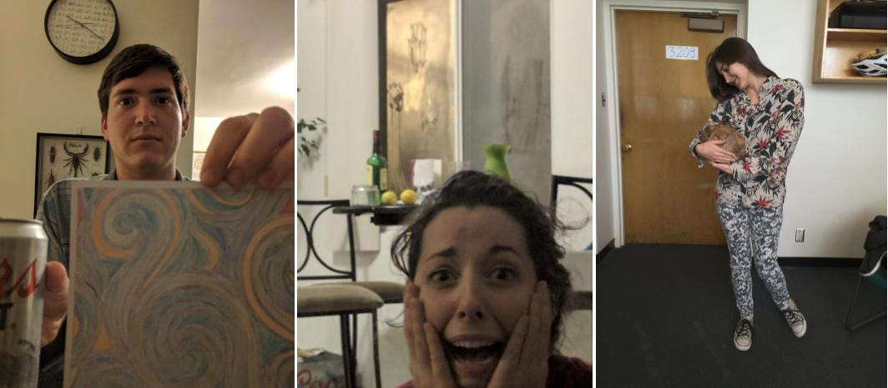

    library(wesanderson); library(RCurl); library(jpeg)

    ## Loading required package: bitops

    URL = ("http://rushmore.shootangle.com/academy/images/quotepicz.jpg")
    image = readJPEG(getURLContent(URL, useragent="curl/7.39.0 Rcurl/1.95.4.5"))  #gets the content of the URL

    h <- data.frame(v = c(1:10, rep(5, 5), 1:10), h = c(rep(1, 10), 1:5, rep(5,10)))
    b <- data.frame(v = c(1:10, 1:10), h = c(c(1,2.5,3.5,2.5,1,1,2.5,3.5,2,1)+10.5, rep(10.5,10)))
    d <- data.frame(v = c(1:10, 1:10), h = c(c(1.05, 2, 3, 4, 5, 5, 4, 3, 2, 1.05)+20, rep(20,10)))

    plot(1, type = "n", xlim = c(0, 27), ylim = c(0, 11), xlab = "", ylab = "", axes = F)
    rect(par("usr")[1],par("usr")[3],par("usr")[2],par("usr")[4],col = wes_palette("Zissou"))
      
    image_points(image, h$h, h$v, cex = 0.9)
    image_points(image, b$h, b$v, cex = 0.9)
    image_points(image, d$h, d$v, cex = 0.9)

### 

